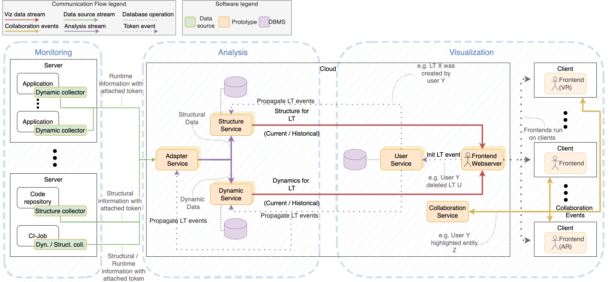

---
hide:
  - navigation
  - toc
---

# Fundamentals

<figure markdown>
{width="1200"}
<figcaption>Conceptual design of our 
software visualization as a service approach</figcaption>
</figure>

To visualize multiple applications in a single software visualization, e.g., distributed software, users can group applications to form a user-owned software landscape (SL). A SL is empty when created (in ExplorViz' frontend) by its initiating user, but can be expanded with applications, which the user intends to visualize. For that, a SL is represented in ExplorViz by so-called landscape tokens (LT), i.e., a unique key-value pair that can be generated in our application. Users decide which of their applications form a specific SL. Applications can share a LT and will end up in the same SL, therefore in the same software visualization.
